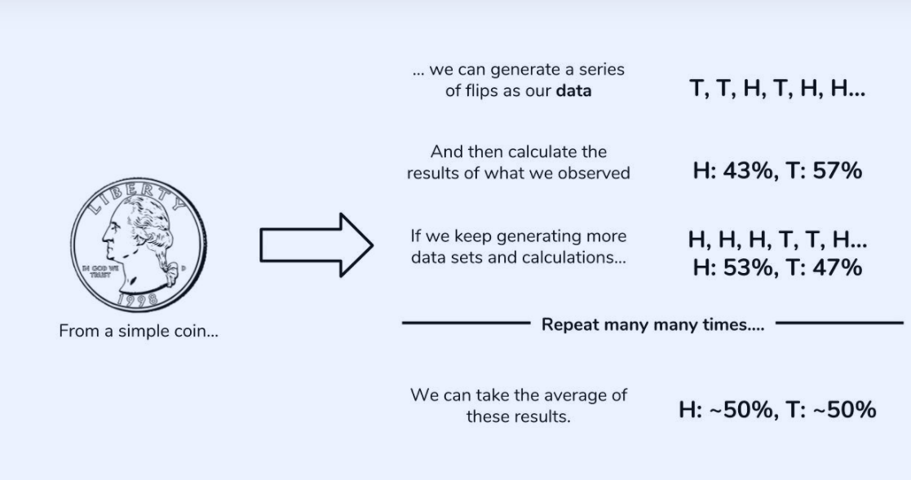
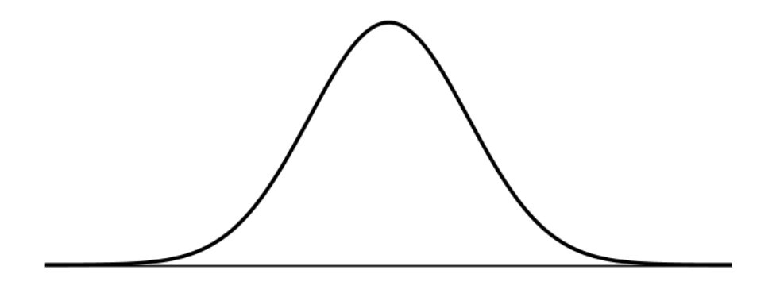

## Dunder Methods
- What Are Dunder Methods?

In Python, special methods are a set of predefined methods you can use to enrich your classes. They are easy to recognize because they start and end with double underscores, for example __init__ or __str__.

 You should treat these methods like a normal language feature.Dunder methods let you emulate the behavior of built-in types. For example, to get the length of a string you can call len('string'). But an empty class definition doesn’t support this behavior out of the box:
```
class NoLenSupport:
    pass

>>> obj = NoLenSupport()
>>> len(obj)
TypeError: "object of type 'NoLenSupport' has no len()"
```
To fix this, you can add a __len__ dunder method to your class:

```
class LenSupport:
    def __len__(self):
        return 42

>>> obj = LenSupport()
>>> len(obj)
42
```
- Object Initialization: __init__
Right upon starting my class I already need a special method. To construct account objects from the Account class I need a constructor which in Python is the __init__ dunder:
```
class Account:
    """A simple account class"""

    def __init__(self, owner, amount=0):
        """
        This is the constructor that lets us create
        objects from this class
        """
        self.owner = owner
        self.amount = amount
        self._transactions = []
```
This allows us to create new accounts like this:
```
>>> acc = Account('bob')  # default amount = 0
>>> acc = Account('bob', 10)
```

- Object Representation: __str__, __repr__

 the are provide a string representation of your object for the consumer of your class (a bit like API documentation.) There are two ways to do this using dunder methods:

__repr__: The “official” string representation of an object. This is how you would make an object of the class. The goal of __repr__ is to be unambiguous.

__str__: The “informal” or nicely printable string representation of an object. This is for the enduser.


- Iteration: __len__, __getitem__, __reversed__

In order to iterate over our account object I need to add some transactions. So first, I’ll define a simple method to add transactions.


- Callable Python Objects: __call__
You can make an object callable like a regular function by adding the __call__ dunder method.  


- Context Manager Support and the With Statement: __enter__, __exit__

A context manager is a simple “protocol” (or interface) that your object needs to follow so it can be used with the with statement. Basically all you need to do is add __enter__ and __exit__ methods to an object if you want it to function as a context manager.


---
## Statistics - Probability

- What is probability?

At the most basic level, probability seeks to answer the question, “What is the chance of an event happening?” An event is some outcome of interest. To calculate the chance of an event happening, we also need to consider all the other events that can occur.

Our data will be generated by flipping a coin 10 times and counting how many times we get heads. We will call a set of 10 coin tosses a trial. Our data point will be the number of heads we observe. We may not get the “ideal” 5 heads, but we won’t worry too much since one trial is only one data point. If we perform many, many trials, we expect the average number of heads over all of our trials to approach the 50%. The code below simulates 10, 100, 1000, and 1000000 trials, and then calculates the average proportion of heads observed. Our process is summarized in the image below as well.


```
import random
def coin_trial():
heads = 0
for i in range(100):
    if random.random() <= 0.5:
        heads +=1
    return heads
def simulate(n):
    trials = []
    for i in range(n):
        trials.append(coin_trial())
    return(sum(trials)/n)
simulate(10)
>>> 5.4
simulate(100)
>>> 4.83
simulate(1000)
>>> 5.055
simulate(1000000)
>>> 4.999781
```

The coin_trial function is what represents a simulation of 10 coin tosses. It uses the random() function to generate a float between 0 and 1, and increments our heads count if it’s within half of that range. Then, simulate repeats these trials depending on how many times you’d like, returning the average number of heads across all of the trials. The coin toss simulations give us some interesting results.

First, the data confirm that our average number of heads does approach what probability suggests it should be. Furthermore, this average improves with more trials. In 10 trials, there’s some slight error, but this error almost disappears entirely with 1,000,000 trials. As we get more trials, the deviation away from the average decreases. Sound familiar? Sure, we could have flipped the coin ourselves, but Python saves us a lot of time by allowing us to model this process in code. As we get more and more data, the real-world starts to resemble the ideal.

Thus, given enough data, statistics enables us to calculate probabilities using real-world observations. Probability provides the theory, while statistics provides the tools to test that theory using data.

The data and the distribution
Before we can tackle the question of “which wine is better than average,” we have to mind the nature of our data. Intuitively, we’d like to use the scores of the wines to compare groups, but there comes a problem: the scores usually fall in a range. How do we compare groups of scores between types of wines and know with some degree of certainty that one is better than the other? Enter the normal distribution.

The normal distribution looks like this:

The most important qualities to notice about the normal distribution is its symmetry and its shape. We’ve been calling it a distribution, but what exactly is being distributed? It depends on the context. In probability, the normal distribution is a particular distribution of the probability across all of the events. The x-axis takes on the values of events we want to know the probability of. The y-axis is the probability associated with each event, from 0 to 1.

We haven’t discussed probability distributions in-depth here, but know that the normal distribution is a particularly important kind of probability distribution. In statistics, it is the values of our data that are being distributed. Here, the x-axis is the values of our data, and the y-axis is the count of each of these values. 


----
## Intro to Statistics

statistics is a really important part of
data science there are  textbooks
and graduate level programs dedicated to
mastering this branch of mathematics . 

 this video presents three major concepts in statistics that all data scientists should understand :
 - Statistical features:
 
  this is probably the most used statistics concept in data science it's usually the first technique we would apply when exploring a data set
and includes concepts like bias variance
 mean median percentiles and many others
 .
-  probability distributions :

it is defined as the percent chance that some event will occur usually this is quantified in the range of 0 to 1 where 0 means we are sure that it won't occur and 1 means we're totally sure it will occur we can think of a probability distribution as a function that represents the probabilities of all possible values in an experiment .

-  and Bayesian statistics :

important concept to know about is Bayesian
statistics is to understand Bayesian stats
we have to first understand frequency
 stats.
 
  frequency statistics is the type of stats that involves applying math to analyze the probability of some
event occurring . 
 
