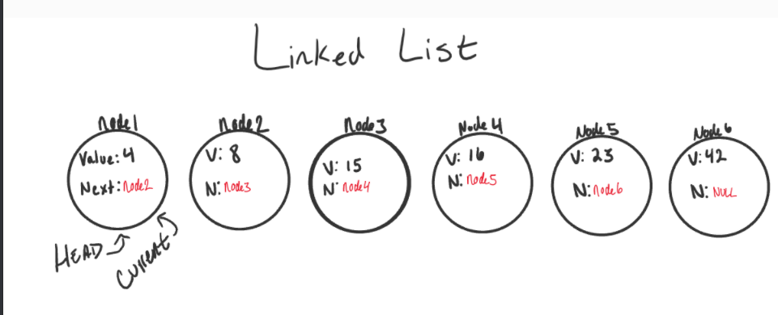

## 1- Linked Lists
What is a Linked List ? 

A Linked List is a sequence of Nodes that are connected/linked to each other. The most defining feature of a Linked List is that each Node references the next Node in the link.

There are two types of Linked List - Singly and Doubly. We will be implementing a Singly Linked List in this implementation.

Terminology:

Linked List - A data structure that contains nodes that links/points to the next node in the list.

Singly - Singly refers to the number of references the node has. A Singly linked list means that there is only one reference, and the reference points to the Next node in a linked list.

Doubly - Doubly refers to there being two (double) references within the node. A Doubly linked list means that there is a reference to both the Next and Previous node.

Node -- Nodes are the individual items/links that live in a linked list. Each node contains the data for each link.

Next - Each node contains a property called Next. This property contains the reference to the next node.
Head - The Head is a reference of type Node to the first node in a linked list.

Current - The Current is a reference of type Node to the node that is currently being looked at. When traversing, you create a new Current variable at the Head to guarantee you are starting from the beginning of the linked list.

What does it look like ? 

Adding a Node:

Adding O(1)
Order of operations is extremely important when it comes to working with a Linked List. What I mean by this is you must be careful that all references to each link/node is properly assigned.

An example can be with adding a node to a linked list. If we want to add a node with an O(1) efficiency, we have to replace the current Head of the linked list with the new node, without losing the reference to the next node in the list.

## What’s a Linked List, Anyway? [Part 1]

Linear data structures
If we really want to understand the basics of linked lists, it’s important that we talk about what type of data structure they are.
One characteristic of linked lists is that they are linear data structures, which means that there is a sequence and an order to how they are constructed and traversed. We can think of a linear data structure like a game of hopscotch: in order to get to the end of the list, we have to go through all of the items in the list in order, or sequentially. Linear structures, however, are the opposite of non-linear structures. In non-linear data structures, items don’t have to be arranged in order, which means that we could traverse the data structure non-sequentially.

Memory management
The biggest differentiator between arrays and linked lists is the way that they use memory in our machines. Those of us who work with dynamically typed languages like Ruby, JavaScript, or Python don’t have to think about how much memory an array uses when we write our code on a day to day basis because there are several layers of abstraction that end up with us not having to worry about memory allocation at all.
But that doesn’t mean that memory allocation isn’t happening! Abstraction isn’t magic, it’s just the simplicity of hiding away things that you don’t need to see or deal with all of the time. Even if we don’t have to think about memory allocation when we write code, if we want to truly understand what’s going on in a linked list and what makes it powerful, we have to get down to the rudimentary level.
We’ve already learned about binary and how data can be broken up into bits and bytes. Just as characters, numbers, words, sentences require bytes of memory to represent them, so do data structures.
When an array is created, it needs a certain amount of memory. If we had 7 letters that we needed to store in an array, we would need 7 bytes of memory to represent that array. But, we’d need all of that memory in one contiguous block. That is to say, our computer would need to locate 7 bytes of memory that was free, one byte next to the another, all together, in one place.
On the other hand, when a linked list is born, it doesn’t need 7 bytes of memory all in one place. One byte could live somewhere, while the next byte could be stored in another place in memory altogether! Linked lists don’t need to take up a single block of memory; instead, the memory that they use can be scattered throughout.

## Big O: Analysis of Algorithm Efficiency

Big O(oh) notation is used to describe the efficiency of an algorithm or function. This efficiency is evaluated based on 2 factors:

Running Time (also known as time efficiency / complexity)
The amount of time a function needs to complete.

Memory Space (also known as space efficiency / complexity)
The amount of memory resources a function uses to store data and instructions.

Overview
Big O’s role in algorithm efficiency is to describe the Worst Case of efficiency an algorithm can have in performing it’s job. It specifically looks at the factors mentioned above, which we often refer to as Space and Time. In order to analyze these limiting factors, we should consider 4 Key Areas for analysis:

- Input Size
- Units of Measurement
- Orders of Growth
- Best Case, Worst Case, and Average Case
- Input Size
- Input Size refers to the size of the parameter values that are read  by the algorithm. This does not simply refer to the number of parameters an algorithm reads, but takes into account the size of each parameter value as well.

Example: If a function uses an array or list as one parameter, then the number of elements within that array or list will directly increase the Input Size of that parameter.

We will use the letter n to refer to the Input Size value.

The higher this number, the more likely there will be an increase to Running Time and Memory Space.

Units of Measurement
To evaluate a function for Time and Space complexity, we need a way to measure each of these factors.

In order to quantify the Running Time in our analysis, we will consider Three Measurements of time:
The time in milliseconds from the start of a function execution until it ends.
For the purposes of Big O, we won’t be considering this measurement since different machines will have different individual run times depending on how powerful they are. Regardless, this will always be a measurement of run-time.

The number of operations that are executed.
Think of this as the number of lines of code that are executed from start to finish of a function.

The number of “Basic Operations” that are executed.
“Basic Operation” refers to the operation that is contributing the most to the total running time. This is usually the most time consuming operation within the inner most loop.

In order to quantify Memory Space, we can consider Four Sources of Memory Usage during function run-time:
The amount of space needed to hold the code for the algorithm.
Think of this as the number of bytes required to store the characters for the instructions specified in your function.

The amount of space needed to hold the input data.
If direct input data is not considered, we may just refer to this as Additional Memory Space since not all functions have direct input values.

The amount of space needed for the output data.
The amount of space needed to hold working space during the calculation.
Working Space can be thought of as the creation of variables and reference points as our function performs calculations. This will also include Stack Space of recursive function calls … specifically how memory usage scales relatively with the size of the input.

## What’s a Linked List, Anyway? [Part 2]

what even is Big O?
Most of us have probably heard the term “Big O Notation”, even if we had no idea what it meant the first time that we heard someone use it. My personal experience with it has always been in the context of designing algorithms (or being asked to evaluate the efficiency of an algorithm). But Big O is really all over and omnipresent within computer science.
The reason for this is that computer science — and effectively, anything that we code — is all about efficiency and tradeoffs. Whether you’re building software as a service, choosing a front end framework, or just trying to make your code DRY and more elegant, that’s what all of us are striving towards: being efficient with our software, and choosing things that are important to what we’re building, all while being aware of the tradeoffs that we’ll ultimately have to make.
The same goes for Big O Notation, but on a much lower level. Big O Notation is a way of evaluating the performance of an algorithm.
There are two major points to consider when thinking about how an algorithm performs: how much time it requires at runtime given how much time and memory it needs.
One way to think about Big O notation is a way to express the amount of time that a function, action, or algorithm takes to run based on how many elements we pass to that function.
For example, if we have a list of the number 1–10, and we wanted to write an algorithm that multiplied each number by 10, we’d think about how much time that algorithm would take to multiply ten numbers. But what if instead of ten numbers, we had ten thousand? Or a million? Or tens of millions? That’s exactly what Big O Notation takes into account: the speed and efficiency with which something functions when its input grows to be any (crazy big!) size.
I really love the way that Parker Phinney describes what Big O notation is used for in his awesome Interview Cake blog post. The way that he explains it, Big O Notation is all about the way an algorithm grows when it runs:
Some external factors affect the time it takes for a function to run: the speed of the processor, what else the computer is running, etc. So it’s hard to make strong statements about the exact runtime of an algorithm. Instead we use big O notation to express how quickly its runtime grows.
If you do a little bit of research on Big O Notation, you’ll quickly find that there are a ton of different equations used to define the space and time complexity of an algorithm, and most of them involve an O (referred to as just “O” or sometimes as “order”), and a variable n, where n is the size of the input (think back to our our ten, thousands, or millions of numbers).
